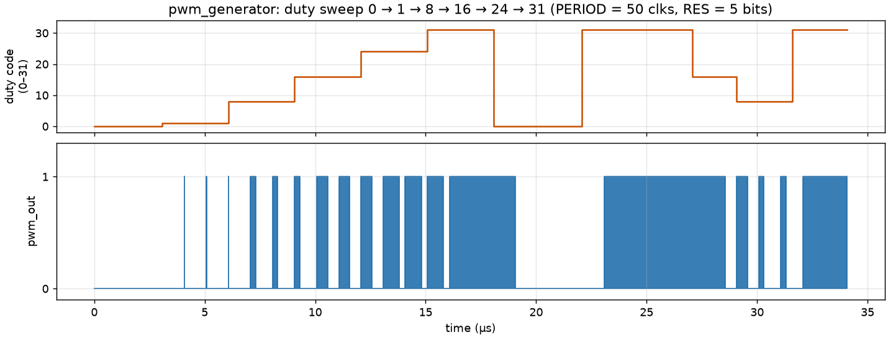
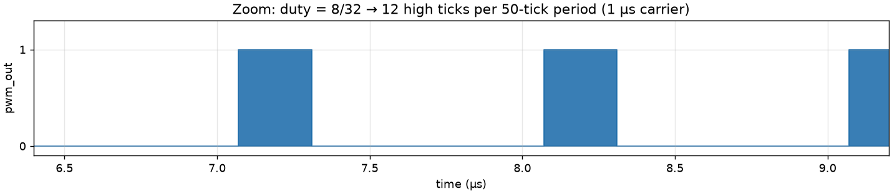
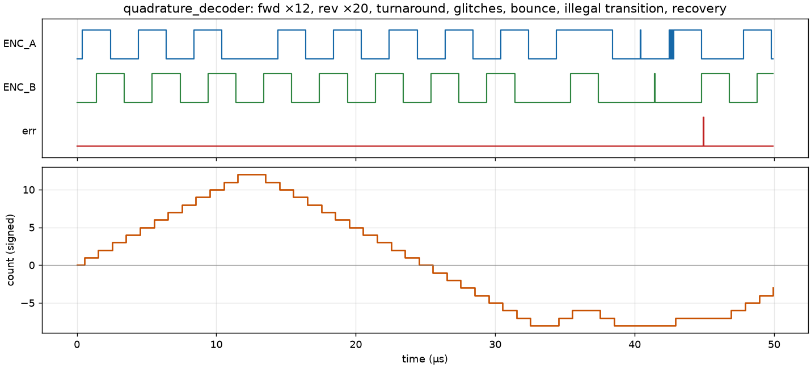
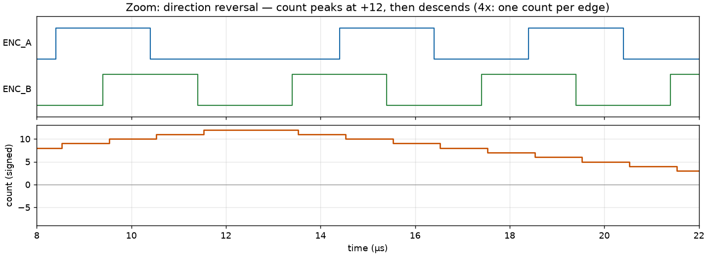

# FPGA Digital Control Core — DE10-Lite

Parameterized **PWM generator** and **quadrature encoder decoder** in Verilog
for the Intel/Terasic DE10-Lite (MAX 10). These are the two peripherals every
motor control loop stands on — and this repo is the tie-back project: it
re-implements, in hardware, exactly the two jobs the Arduino did in
**Project 2** (PWM drive to the H-bridge) and **Project 4** (encoder feedback
for closed-loop control), so the loop can eventually close *inside the FPGA*
instead of in Arduino firmware.

```
├── rtl/                          synthesizable Verilog
│   ├── pwm_generator.v           parameterized PWM (frequency + resolution)
│   ├── quadrature_decoder.v      4x quadrature decode, debounce, direction, error flag
│   └── top_de10_lite.v           board wrapper: switches → duty, encoder → LEDs
├── testbench/                    self-checking testbenches (Icarus Verilog)
│   ├── tb_pwm_generator.v
│   ├── tb_quadrature_decoder.v
│   ├── Makefile                  `make` runs everything
│   └── plot_waves.py             renders the waveform PNGs below from the VCDs
├── synthesis/                    complete Quartus Prime project
│   ├── de10_lite_control_core.qpf / .qsf / .sdc
│   └── README.md                 build + program instructions, full pin map
└── docs/waves/                   waveform images from the testbench runs
```

## How this ties back to Projects 2 and 4

On the Arduino builds, the control loop looked like this:

```
Project 2:  analogWrite() ──► H-bridge ──► motor            (open/closed-loop drive)
Project 4:  encoder ──► pin-change ISRs ──► count ──► PID ──► analogWrite()
```

That architecture has two ceilings baked in:

1. **PWM quality** — `analogWrite()` on an Uno is ~490 Hz/976 Hz at 8 bits.
   Audible whine, coarse torque quantization, and the timer is shared with
   `millis()`.
2. **Encoder throughput** — every quadrature edge costs an interrupt. Spin the
   motor fast enough (or add a finer encoder) and the ISR load starves the
   loop, drops edges, and the position estimate silently corrupts.

This project moves both jobs into fabric, where they cost *zero* processor
time and run at 50 MHz:

| Arduino (Projects 2/4) | This core |
|---|---|
| `analogWrite()`, ~490 Hz, 8-bit | `pwm_generator`, 20 kHz (any freq), 10-bit (any width), glitch-free duty updates |
| Pin-change ISR counting, 1x/2x decode, edges lost under load | `quadrature_decoder`, full 4x decode, never misses an edge, hardware glitch filter, illegal-transition detector |
| Loop rate limited to a few kHz | `period_start` strobe lets a loop run once per PWM period (20 kHz) with zero jitter |

The **next step** this enables: drop a PID block between `count` and `duty`
in `top_de10_lite.v` — the decoder's output is the feedback term, the PWM's
input is the control effort, and `period_start` is the sample clock. Same
loop as Project 4, closed digitally in fabric instead of on the Arduino. The
Arduino (or the Nios II soft core, or a PC over UART) then only supplies
*setpoints* rather than running the loop.

## The modules

### `rtl/pwm_generator.v`

| Parameter | Default | Meaning |
|---|---|---|
| `CLK_FREQ_HZ` | 50_000_000 | input clock (DE10-Lite oscillator) |
| `PWM_FREQ_HZ` | 20_000 | carrier frequency |
| `RESOLUTION` | 10 | duty-input width in bits |

Frequency and resolution are independent: the period is
`CLK_FREQ_HZ / PWM_FREQ_HZ` clocks and the duty code is scaled onto it, so
you pick both freely (rule of thumb: keep `period ≥ 2^RESOLUTION` so every
code is distinct — at 50 MHz/20 kHz you get 2500 ticks, enough for 11 bits).
Details that matter for motor drive:

- **True 0% and true 100%**: duty 0 is DC-low, duty max is DC-high — no
  sliver pulses at the extremes (sliver pulses are what blow H-bridge
  drivers).
- **Double-buffered duty**: the duty input is latched only at period
  boundaries, so a mid-period update can never produce a runt pulse.
- **`period_start` strobe**: one pulse per carrier period — the natural
  sample clock for a digital control loop.

### `rtl/quadrature_decoder.v`

| Parameter | Default | Meaning |
|---|---|---|
| `COUNT_WIDTH` | 16 | signed position counter width |
| `DEBOUNCE_TICKS` | 50 | clocks a level must persist before it's accepted (0 = bypass) |

Each channel goes through a 2-flop synchronizer (encoder edges are
asynchronous) and then a persistence glitch filter: a new level is only
accepted after it holds for `DEBOUNCE_TICKS` consecutive clocks — 1 µs at
the default 50/50 MHz, which rejects contact bounce and cable noise while
passing any encoder slower than ~250k edges/s. Decoding is **full 4x**
(every edge of A and B counts), with:

- signed position `count`, direction flag `dir` (A-leads-B = up),
- a one-clock `step` pulse per counted edge (feeds a velocity estimator),
- an `err` pulse when both channels change in one filtered sample — a
  skipped state, which the Arduino ISR version would have silently absorbed
  as position drift. Here it's observable.

### `rtl/top_de10_lite.v` — hardware demo wrapper

`SW[9:0]` set the 10-bit duty, `KEY0` is reset, `KEY1` drives a `MOTOR_DIR`
output for an H-bridge, the encoder count's low 10 bits show live on
`LEDR[9:0]`, and the 20 kHz PWM comes out on the GPIO header.

## Verification

### Why Icarus Verilog (and not Verilator)

Both are fine tools; Icarus is the right fit *here*:

- These testbenches lean on **event-driven, asynchronous timing** — encoder
  edges, 40 ns glitches, and contact bounce are modeled with `#delay`
  statements unrelated to the clock. That's native in Icarus. Verilator is
  cycle-based: modeling sub-cycle async glitches means hand-writing a C++
  harness that toggles inputs between evaluations — more code to get *less*
  faithful stimulus.
- Self-checking is done with plain Verilog tasks — no C++ build system,
  `make` and 2 seconds of wall time is the whole flow.
- Verilator's advantage is raw speed on big designs (thousands of cycles per
  second matter when you simulate a CPU for minutes). These sims finish in
  milliseconds; the speed is irrelevant.
- Icarus dumps VCD out of the box for GTKWave (and for the plots below).

If this grows into a full in-fabric PID with long closed-loop simulations, a
Verilator + C++ plant-model co-simulation would be the right upgrade — noted
as future work.

### Running the testbenches

```bash
sudo apt install iverilog     # or: brew install icarus-verilog
cd testbench
make                          # runs both, prints PASS/FAIL per check
make waves                    # opens the VCDs in GTKWave
```

Both testbenches measure the DUT against an independent model and print a
verdict — they don't just wiggle pins. Current status: **23/23 checks pass**.

**PWM checks:** duty extremes (0% must be DC-low, 100% must be DC-high —
verified over multiple full periods), minimum 1-tick pulse, 25/50/75%
linearity by counting high clocks per period, exact period length, and
glitch-free double-buffering (a mid-period duty change must not alter the
period in flight, and must apply on the next one).

**Encoder checks:** 12 edges forward, 20 reverse crossing zero (signed
count), **direction reversal mid-cycle** (turnaround between detents nets to
zero), `dir` flag both ways, sub-filter glitches on A and B ignored, a
**bouncing edge counted exactly once**, an illegal two-bit transition
pulsing `err` with the count held, and correct counting after recovery.

### Waveforms from the actual runs

Rendered straight from the testbench VCDs by `testbench/plot_waves.py`
(`pip install matplotlib`, run after `make`):

**PWM duty sweep** — 0 → 1 → 8 → 16 → 24 → 31/31. Note the output is
solid-low at duty 0 and solid-high at duty 31 (the ~18–23 µs and ~23–27 µs
regions), not thin slivers:



**Zoom, duty = 8/32 (25%)** — 12 high ticks out of the 50-tick period, every
period identical:



**Encoder, full run** — forward, reverse through zero, turnaround, the two
rejected glitches (~40 µs, visible as slivers on A then B), the bounce burst
(~42.5 µs, counted once), and the `err` pulse at the deliberate illegal
transition (~45 µs) with the count held flat:



**Zoom on the direction reversal** — watch A-leads-B swap to B-leads-A at
the peak; one count per edge (4x) in both directions:



## Synthesis

`synthesis/` holds a complete Quartus Prime Lite project (`.qpf`, `.qsf`
with every pin assignment annotated with its physical header pin, and an
`.sdc` with the 50 MHz clock constraint). See
[`synthesis/README.md`](synthesis/README.md) for the build/program steps and
the full pin map.

## Hardware verification

Beyond simulation, bringing this up on real DE10-Lite hardware means:
programming the `.sof` over the on-board USB-Blaster (steps in
[`synthesis/README.md`](synthesis/README.md)); probing `PWM_OUT` (GPIO
header JP1 pin 3) to confirm the 20 kHz carrier and glitch-free
double-buffered duty updates; and wiring a real quadrature encoder to
`ENC_A`/`ENC_B` (JP1 pins 1–2), noting that MAX 10 I/O is **3.3 V only** and
not 5 V-tolerant — a 5 V encoder needs a level shifter or resistor divider.
With `PWM_OUT` + `MOTOR_DIR` driving an H-bridge, the full PWM-to-motor and
encoder-to-count signal chain exists on the FPGA, which is what the
follow-on in-fabric PID closes the loop on.
